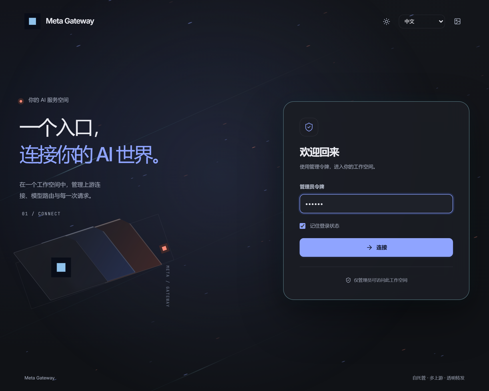
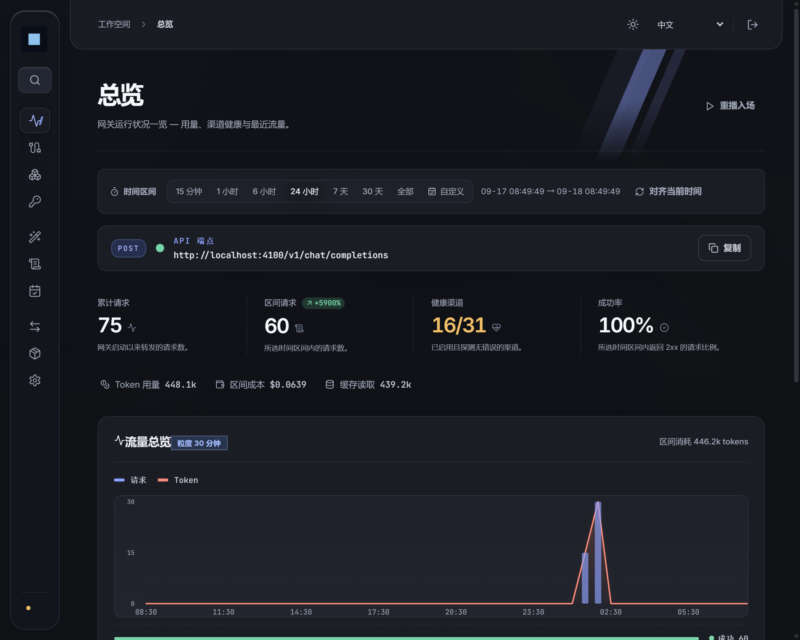
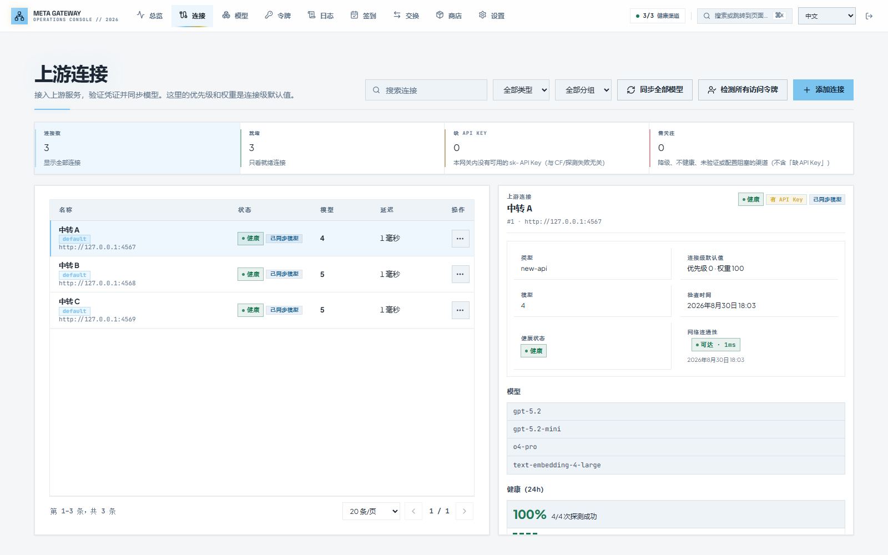
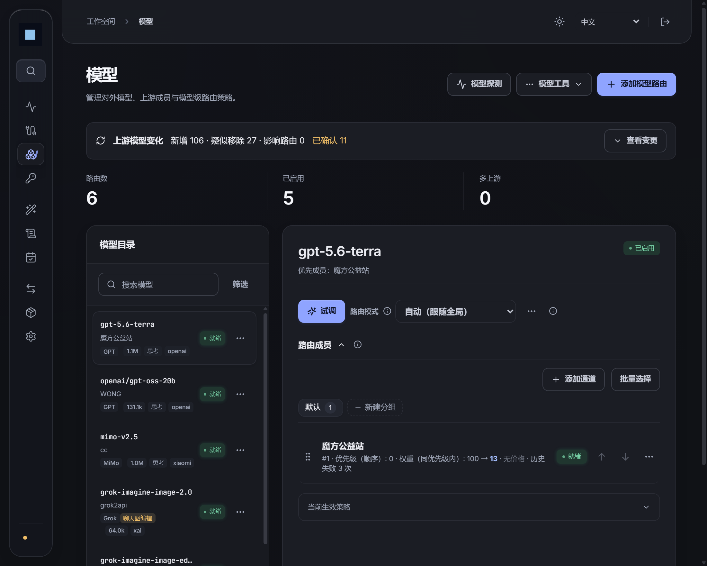
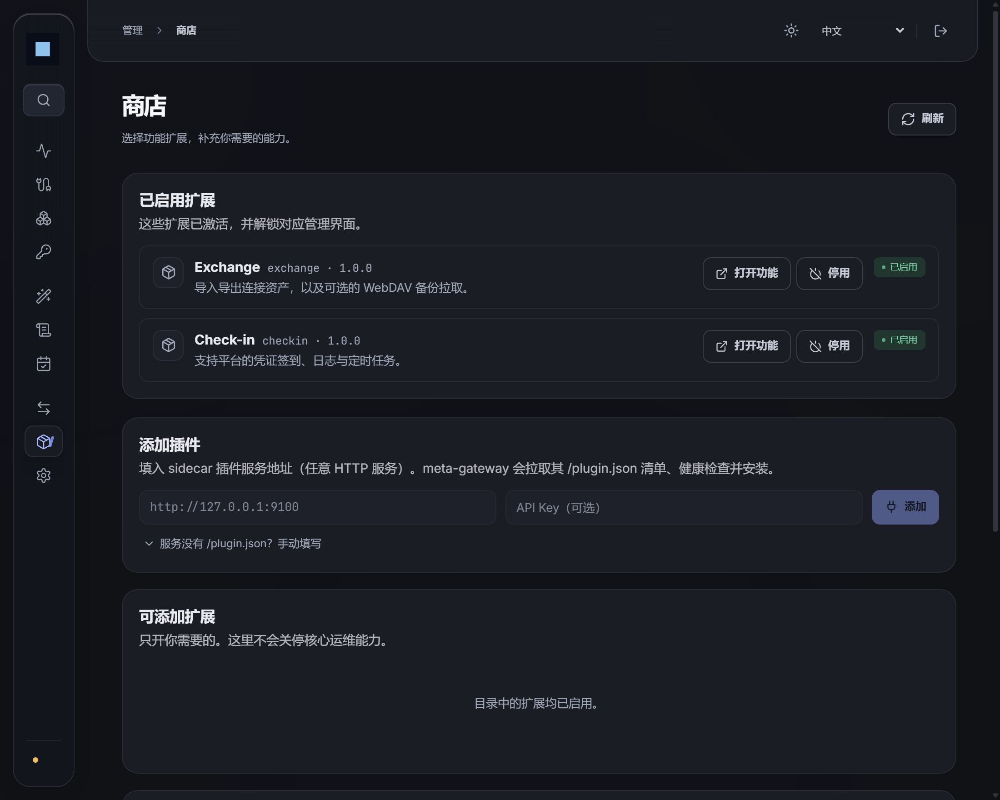

<div align="center">

<h1>Meta Gateway</h1>

**多通道 AI 中继网关 — 智能路由 · 故障转移 · 便携切换**

<p>
把分散在各处的 AI API 聚合为<strong>一个统一入口</strong>，
<br>
自动发现模型、智能路由、按优先级/权重分流，上游故障自动切换。
</p>

<p>
<a href="https://github.com/ZiChuanLan/meta-gateway/releases">
  
</a>
<a href="https://github.com/ZiChuanLan/meta-gateway/stargazers">
  
</a>
<a href="https://hub.docker.com/r/zichuanlan/meta-gateway">
  
</a>
<a href="https://github.com/ZiChuanLan/meta-gateway/blob/master/LICENSE">
  
</a>


</p>

<p>
  <a href="#-快速开始"><strong>快速开始</strong></a> ·
  <a href="#-功能特性">功能特性</a> ·
  <a href="#-界面预览">界面预览</a> ·
  <a href="#-部署指南">部署指南</a> ·
  <a href="#-配置说明">配置</a> ·
  <a href="#-架构设计">架构</a> ·
  <a href="#-常见问题">FAQ</a>
</p>

</div>

---

## 🌟 简介

现在 AI 生态里有越来越多基于 New API / One API 系列的聚合中转站。要管理多个站点的余额、模型列表和 API 密钥，往往既分散又费时。

**Meta Gateway** 作为这些中转站之上的**元聚合层（Meta-Aggregation Layer）**，把多个站点统一到**一个入口**——下游所有工具（Cursor、Claude Code、Codex、Open WebUI 等）即可无感接入全部模型。

| 痛点 | Meta Gateway 怎么解决 |
| --- | --- |
| 🔑 每个站点一个 Key，下游工具配置一堆 | **统一代理入口**，一个 Key 访问全部模型 |
| 💸 不知道哪个站点用某个模型最便宜 | **智能路由** 自动按优先级/权重选最优通道 |
| 🔄 某个站点挂了，手动切换好麻烦 | **自动故障转移**，一个通道失败自动冷却并切到下一个 |
| 📊 希望同模型下切换渠道 | **便捷直观** 可以直接固定单通道 |
| ✅ 每天得去各站签到领额度 | **自动签到** 定时执行，支持外站 Cookie 签到 |
| 🤷 不知道哪个站有什么模型 | **自动模型发现**，上游新增模型零配置出现在你的模型列表里 |
| 🧩 想加功能但不想改核心代码 | **插件市场** 社区贡献扩展，一键安装 |

当前支持的上游范围包括：

- **聚合面板**：New API、One API、OneHub、DoneHub、Veloera、AnyRouter、Sub2API 等
- **通用兼容接口**：OpenAI / Anthropic / Gemini compatible endpoints
- **官方预设**：DeepSeek、智谱 GLM、月之暗面 Moonshot、MiniMax 等
- **OAuth 连接**：Codex、Claude、Gemini CLI

---

## 📸 界面预览

<table>
  <tr>
    <td align="center">
      
      <div><b>登录页</b> — ADMIN_TOKEN 认证，令牌仅存于内存</div>
    </td>
    <td align="center">
      
      <div><b>总览</b> — 流量统计、渠道健康、最近日志</div>
    </td>
  </tr>
  <tr>
    <td align="center">
      
      <div><b>上游连接</b> — 多站点管理、健康状态、模型同步</div>
    </td>
    <td align="center">
      
      <div><b>模型路由</b> — 路由策略、成员优先级、试调面板</div>
    </td>
  </tr>
  <tr>
    <td align="center">
      
      <div><b>插件商店</b> — 扩展安装、配置、启用/停用</div>
    </td>
    <td align="center">
    </td>
  </tr>
</table>

---

## 🚀 快速开始

### 方式一：Docker Compose（推荐）

```bash
mkdir meta-gateway && cd meta-gateway

cat > docker-compose.yml << 'EOF'
services:
  meta-gateway:
    image: zichuanlan/meta-gateway:latest
    ports:
      - "4100:4100"
    volumes:
      - ./data:/data
    environment:
      ADMIN_TOKEN: ${ADMIN_TOKEN:?ADMIN_TOKEN is required}
      MASTER_KEY: ${MASTER_KEY:?MASTER_KEY is required}
      METRICS_TOKEN: ${METRICS_TOKEN:?METRICS_TOKEN is required}
    restart: unless-stopped
EOF

# 设置密钥并启动
export ADMIN_TOKEN=your-admin-token
export MASTER_KEY=your-32-char-master-key-for-encryption!!
export METRICS_TOKEN=your-metrics-token
docker compose up -d
```

启动后访问 `http://localhost:4100/console/`，用 `ADMIN_TOKEN` 登录即可。

<details>
<summary><strong>一行 Docker 命令</strong></summary>

```bash
docker run -d --name meta-gateway \
  -p 4100:4100 \
  -e ADMIN_TOKEN=your-admin-token \
  -e MASTER_KEY=your-32-char-master-key-for-encryption!! \
  -e METRICS_TOKEN=your-metrics-token \
  -v ./data:/data \
  --restart unless-stopped \
  zichuanlan/meta-gateway:latest
```

</details>

> [!IMPORTANT]
> 请务必修改 `ADMIN_TOKEN`、`MASTER_KEY` 和 `METRICS_TOKEN`，不要使用默认值。数据存储在 `./data` 目录，升级不会丢失。

### 方式二：源码构建

```bash
# 前置条件
# Go 1.26+ / Node.js 24+（仅构建前端）/ SQLite（内嵌，无需安装）

git clone https://github.com/ZiChuanLan/meta-gateway.git
cd meta-gateway

# 构建前端
cd web && npm ci && npm run build && cd ..

# 构建后端
go build -o bin/meta-gateway ./cmd/server

# 启动
ADMIN_TOKEN=my-token MASTER_KEY=my-32-char-key-for-encryption! ./bin/meta-gateway
```

### 验证

```bash
curl http://127.0.0.1:4100/readyz
# → {"status":"ok"}
```

---

## ✨ 功能特性

### 核心中继

- **OpenAI 兼容 API**：`/v1/chat/completions`、`/v1/completions`、`/v1/embeddings`、`/v1/images/*`
- **Anthropic 原生**：`/v1/messages`（自动翻译 OpenAI ↔ Anthropic 格式）
- **Gemini 原生**：`/v1/chat/completions` → `generateContent` 自动翻译
- **SSE 流式传输**：全协议支持 Server-Sent Events
- **多下游 Key**：支持 Key 级别的作用域（`relay`/`chat`/`models`/`embeddings` 等）

### 智能路由

- **优先级 + 权重**：高优先级先匹配，同级内按权重分流
- **自动故障转移**：上游 5xx/超时自动重试下一个通道
- **冷却机制**：连续失败的通道自动冷却，冷却到期自动恢复探测
- **跨通道重试**：同 Key 重发 → 换 Key → 换通道，逐级升级
- **灰度发布**：`stable_first` 通道先接 1/N 流量，验证后自动提升

### 多通道管理

- **多站点聚合**：一个管理面板管理所有上游站点
- **自动模型发现**：一键同步上游模型列表，自动创建路由
- **凭证加密存储**：AES 加密，密钥不入库、不入日志、不入 API 响应
- **优先级/权重排序**：拖拽调整通道优先级，支持批量操作

### 运维能力

- **签到调度**：New API / One API 系站点自动签到，外站 Cookie 签到
- **资产交换**：导入/导出连接配置，WebDAV 云备份
- **审计日志**：所有管理操作留痕，支持保留策略
- **在线备份**：SQLite 热备份 + 校验，一键恢复
- **告警规则**：指标 → Webhook 告警（Bark/ServerChan/Telegram/SMTP）
- **运行时热配置**：重试次数、限流、审计保留等参数在线调整无需重启

### 插件生态

- **插件市场**：官方 + 社区插件，一键安装
- **托管进程**：网关下载并拉起插件进程，自动健康检查
- **配置管理**：`config_fields` 声明式配置，secret 掩码保护
- **官方扩展**：Exchange（资产交换）、Check-in（签到调度）

---

## ⚙️ 配置说明

### 必填环境变量

| 变量 | 说明 |
| --- | --- |
| `ADMIN_TOKEN` | 管理后台登录令牌（Bearer Token） |
| `MASTER_KEY` | 数据加密密钥（≥32 字符，用于加密凭证） |
| `METRICS_TOKEN` | `/metrics` 端点访问令牌 |

### 可选环境变量

| 变量 | 默认值 | 说明 |
| --- | --- | --- |
| `HTTP_ADDR` | `:4100` | 监听地址 |
| `DATA_DIR` | `./data` | 数据存储目录 |
| `EXCHANGE_ALLOW_SECRET_EXPORT` | `true` | 允许导出含密钥的资产 |
| `BACKUP_RETENTION_COUNT` | `30` | 备份保留数量（0 禁用） |
| `RETRY_TIMES` | `2` | 重试轮次（每个轮次多尝试一个通道） |
| `CHANNEL_RETRY_TIMES` | `1` | 同通道重发次数 |
| `CHANNEL_AUTO_DISABLE_THRESHOLD` | `5` | 连续失败后自动禁用阈值（0 禁用） |
| `ROUTING_LATENCY_AWARE` | `true` | 延迟感知路由 |
| `ROUTING_ERROR_AWARE` | `true` | 错误率感知路由 |
| `CROSS_CHANNEL_FAILOVER_ENABLED` | `true` | 跨通道故障转移 |
| `CHECKIN_ENABLED` | `false` | 启用签到调度 |
| `CHECKIN_TZ` | (系统) | 签到时区（如 `Asia/Shanghai`） |
| `PLUGIN_MARKET_URLS` | (内置) | 额外插件市场源（逗号分隔） |

完整配置列表见 [docs/operations.md](docs/operations.md)。

---

## 🏗️ 架构设计

```
┌─────────────────────────────────────────────────────────┐
│                    下游客户端                             │
│         Cursor / Claude Code / Open WebUI / ...         │
└───────────────────────┬─────────────────────────────────┘
                        │ Bearer Token
                        ▼
┌─────────────────────────────────────────────────────────┐
│                  Meta Gateway                            │
│                                                         │
│  ┌──────────┐  ┌──────────┐  ┌──────────┐              │
│  │ 令牌验证  │→│ 模型路由  │→│ 重试/故障 │              │
│  │          │  │ 优先级   │  │ 转移      │              │
│  └──────────┘  │ 权重     │  └────┬─────┘              │
│                └──────────┘       │                      │
│                                   ▼                      │
│  ┌──────────────────────────────────────────┐           │
│  │            出站策略（SSRF 防护）           │           │
│  │  DNS 校验 · 重定向校验 · 代理路由          │           │
│  └──────────────────────────────────────────┘           │
└───────────────────────┬─────────────────────────────────┘
                        │
        ┌───────────────┼───────────────┐
        ▼               ▼               ▼
   ┌─────────┐    ┌─────────┐    ┌─────────┐
   │ 站点 A   │    │ 站点 B   │    │ 站点 C   │
   │ New API  │    │ One API  │    │ 原生 API │
   └─────────┘    └─────────┘    └─────────┘
```

详细架构文档见 [docs/architecture.md](docs/architecture.md)。

---

## 📖 API 概览

### 公开端点（需要下游 Key）

| 方法 | 路径 | 说明 |
| --- | --- | --- |
| GET | `/v1/models` | 可用模型列表 |
| POST | `/v1/chat/completions` | 聊天补全（支持 SSE） |
| POST | `/v1/completions` | 文本补全 |
| POST | `/v1/embeddings` | 向量嵌入 |
| POST | `/v1/responses` | OpenAI Responses API |
| POST | `/v1/messages` | Anthropic Messages API |
| POST | `/v1/images/generations` | 图片生成 |
| GET | `/v1/dashboard/billing/credit_summary` | 额度/余额查询 |
| POST | `/v1/redemption/redeem` | 兑换额度码 |

### 管理端点（需要 ADMIN_TOKEN）

| 方法 | 路径 | 说明 |
| --- | --- | --- |
| GET | `/admin/sites` | 上游站点列表 |
| POST | `/admin/sites` | 创建站点 |
| GET | `/admin/channels` | 通道列表 |
| POST | `/admin/channels` | 创建通道 |
| GET | `/admin/models` | 模型路由列表 |
| POST | `/admin/routes` | 创建模型路由 |
| GET | `/admin/downstream-keys` | 下游 Key 列表 |
| POST | `/admin/downstream-keys` | 创建下游 Key |
| GET | `/admin/plugins/status` | 插件状态 |
| GET | `/admin/checkin/logs` | 签到日志 |
| POST | `/admin/exchange/export` | 导出资产 |
| POST | `/admin/exchange/import` | 导入资产 |
| POST | `/admin/backups` | 创建备份 |

完整 API 列表见 [docs/operations.md](docs/operations.md)。

---

## 🛡️ 安全边界

- **凭证加密**：所有密钥使用 AES 加密存储，解密仅在请求构造时发生，日志/API 响应中永远不出现明文
- **出站策略**：所有出站请求走统一 SSRF 防护——DNS 校验、重定向重校验、跨域凭证移除、环回/内网地址默认拒绝
- **令牌隔离**：ADMIN_TOKEN 仅存于浏览器内存/Tab SessionStorage，不进 Cookie、不进 URL
- **审计留痕**：所有管理操作记录审计事件，支持保留策略
- **插件沙箱**：插件进程继承白名单环境变量，网关密钥（ADMIN_TOKEN/MASTER_KEY）不泄露给插件

---

## 🔧 常见问题

<details>
<summary><strong>Q: 支持哪些上游平台？</strong></summary>

支持所有兼容 OpenAI / Anthropic / Gemini 接口的平台，包括但不限于：New API、One API、OneHub、DoneHub、Veloera、AnyRouter、Sub2API、DeepSeek、智谱 GLM、月之暗面 Moonshot 等。连接时选择对应的平台类型即可。
</details>

<details>
<summary><strong>Q: 如何添加一个新的上游站点？</strong></summary>

管理后台 → 连接 → 添加连接 → 填写站点地址和 API Key → 同步模型 → 完成。路由会自动按优先级分配。
</details>

<details>
<summary><strong>Q: 支持 Claude 官方 API 吗？</strong></summary>

支持。连接类型选择 "Anthropic (Claude Official)"，填入 API Key，网关会自动处理 Anthropic 认证头和 `/v1/messages` 路径翻译。下游客户端调用标准 `/v1/chat/completions` 即可。
</details>

<details>
<summary><strong>Q: 如何配置自动故障转移？</strong></summary>

默认已启用。只需为同一个模型配置多个通道（不同优先级），当高优先级通道失败时会自动尝试低优先级通道。可通过 `RETRY_TIMES` 调整重试轮次，`CHANNEL_AUTO_DISABLE_THRESHOLD` 调整自动禁用阈值。
</details>

<details>
<summary><strong>Q: Docker 镜像支持哪些架构？</strong></summary>

支持 `linux/amd64` 和 `linux/arm64`。
</details>

<details>
<summary><strong>Q: 如何备份和恢复？</strong></summary>

管理后台 → 设置 → 备份，点击"创建备份"即可。恢复时停止服务后运行 `meta-gateway restore --from <备份文件>`。备份包含加密凭证，恢复时需使用相同的 `MASTER_KEY`。
</details>

---

## 🤝 参与贡献

欢迎提交 Issue 和 Pull Request！请先阅读 [CONTRIBUTING.md](CONTRIBUTING.md)。

## 📄 开源协议

本项目基于 [MIT License](LICENSE) 开源。

## 🙏 致谢

- [CLIProxyAPI](https://github.com/router-for-me/CLIProxyAPI) — 插件市场设计参考
- [metapi](https://github.com/cita-777/metapi) — README 结构参考
- [New API](https://github.com/QuantumNous/new-api) / [One API](https://github.com/songquanpeng/one-api) — 上游兼容生态
