<div align="center">

<picture>
  <source media="(prefers-color-scheme: dark)" srcset="docs/marketing/hero-dark.png">
  <source media="(prefers-color-scheme: light)" srcset="docs/marketing/hero-light.png">
  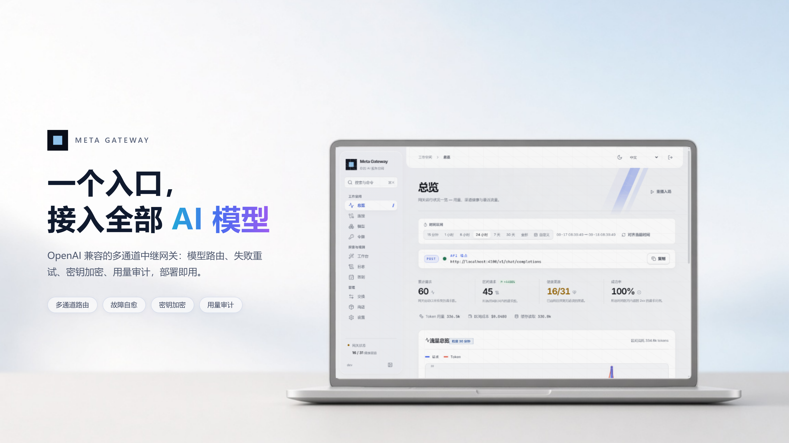
</picture>

<p>
  <a href="https://github.com/ZiChuanLan/meta-gateway/actions/workflows/ci.yml"></a>
  <a href="https://hub.docker.com/r/zichuanlan/meta-gateway"></a>
  <a href="https://github.com/ZiChuanLan/meta-gateway/releases"></a>
  <a href="https://github.com/ZiChuanLan/meta-gateway/stargazers"></a>
  <a href="https://github.com/ZiChuanLan/meta-gateway/blob/master/LICENSE"></a>
</p>

<p>
  
  
  
  
  <a href="https://github.com/ZiChuanLan/meta-gateway/issues"></a>
</p>

</div>

> [!TIP]
> **在线体验** · <https://mg.015201314.xyz> — 登录密码 `123456`
>
> 公开演示环境，请勿存放生产敏感密钥。控制台内置 **经典 / 现代** 双外观与明暗主题，登录后即可切换体验。

<a id="screenshots" name="screenshots"></a>

##  双外观 · 经典 / 现代

<div align="center">

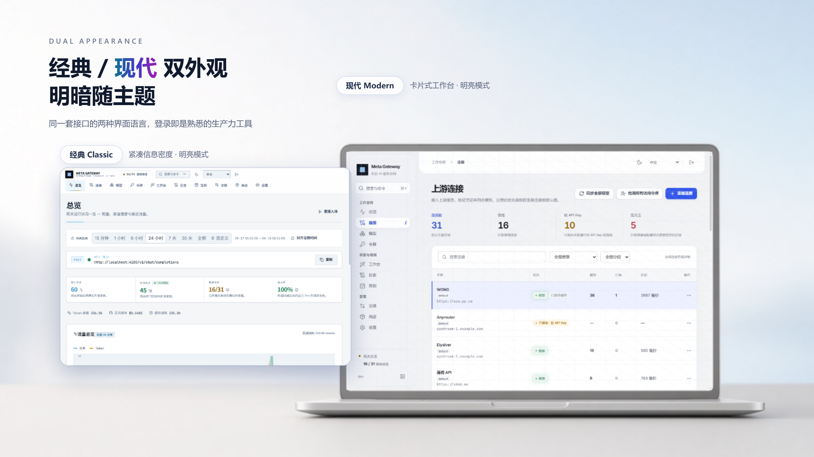

**经典 Classic** 紧凑信息密度，适合长时间盯盘运维 ｜ **现代 Modern** 卡片式工作台，层次更舒展

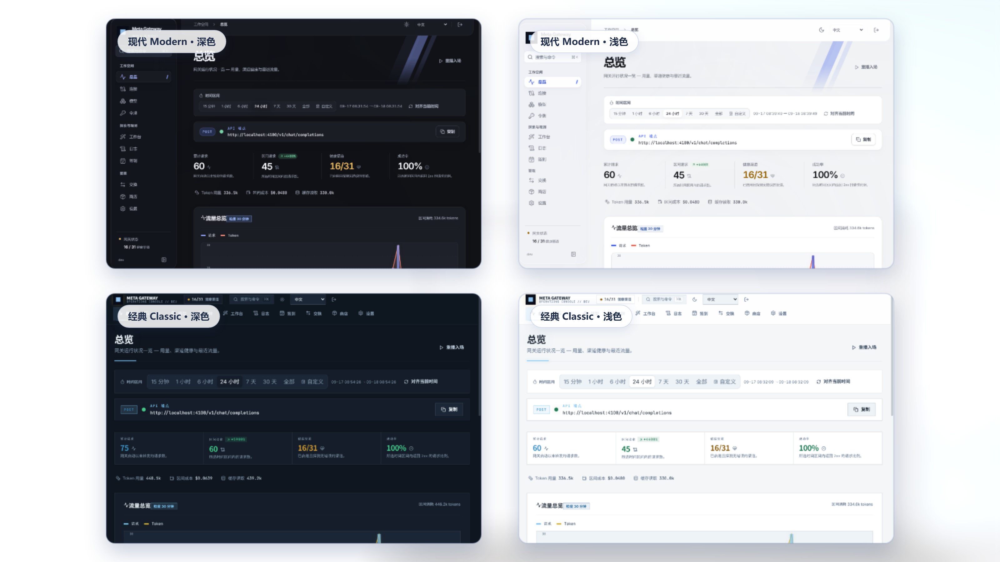

两套外观 × 明暗两种主题共 4 种组合，随时切换，偏好按浏览器维度记忆。

</div>

##  核心亮点

<div align="center">

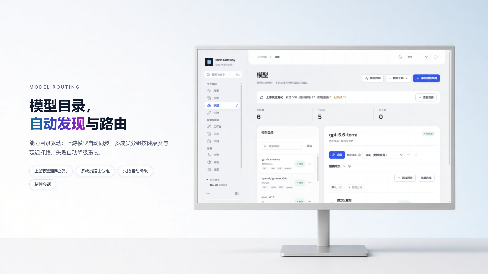

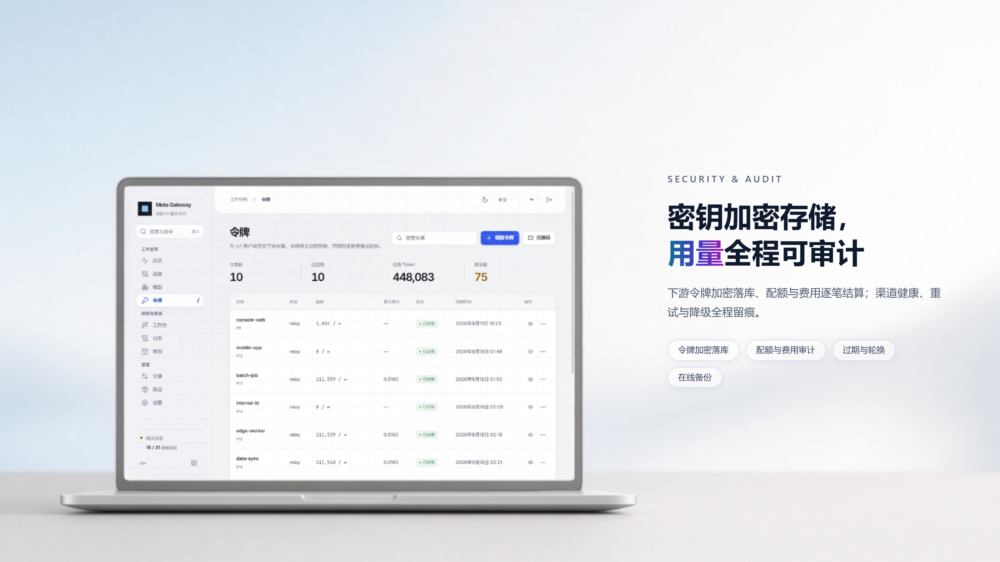

</div>

##  界面预览

<div align="center">

| <br><b>安全控制台</b> · 管理令牌登录，暗色 / 明亮双主题 | <br><b>数据总览</b> · 实时吞吐、渠道健康与流量追踪 |
| :---: | :---: |
| 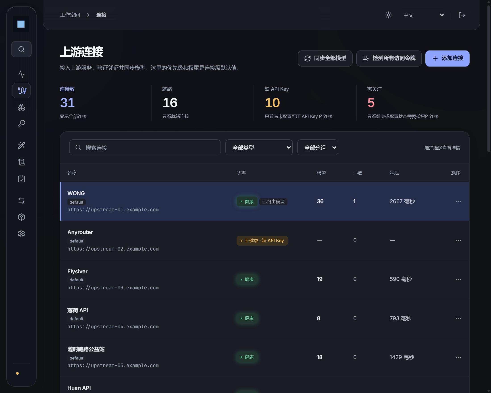<br><b>上游连接</b> · 多源站点、自动模型发现与鉴权 | <br><b>模型路由</b> · 成员优先级、权重负载与别名归一 |
| 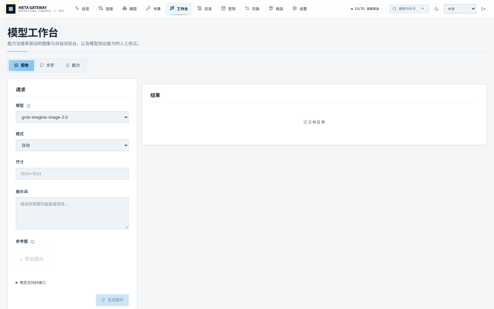<br><b>模型工作台</b> · 图像生成编辑、文字流式对话与能力校正 | 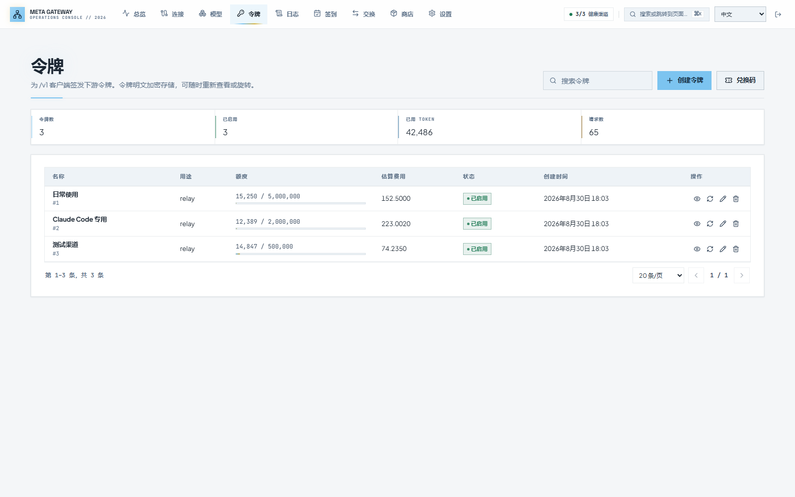<br><b>令牌管理</b> · 独立额度、路由分组绑定与调用统计 |
| 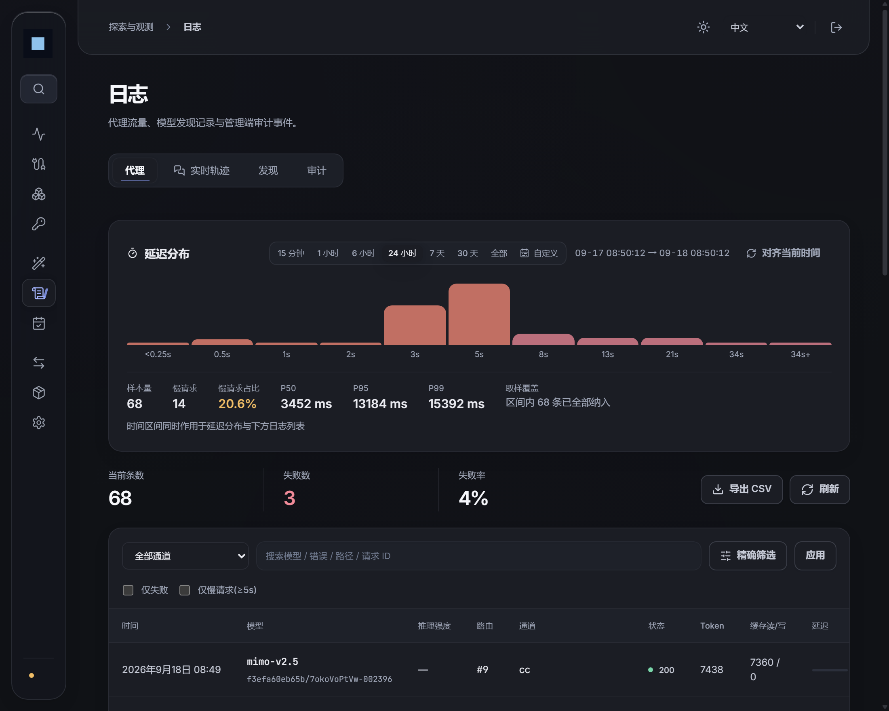<br><b>日志观测</b> · 延迟分布、失败率与代理审计 | 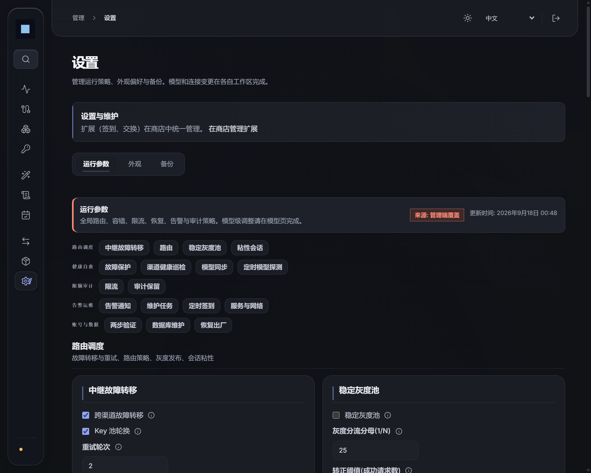<br><b>运行参数</b> · 故障转移、灰度发布与全局策略 |
| <br><b>插件市场</b> · 模块化扩展、沙箱隔离与托管进程 | 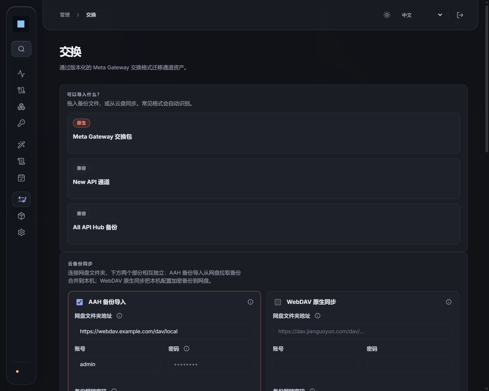<br><b>资产交换</b> · 拓扑快照、加密导入与 WebDAV 备份 |

</div>

<p align="center">
  <a href="#intro"><strong>核心价值</strong></a> ·
  <a href="#features">特性矩阵</a> ·
  <a href="#ai-prompt"><strong>AI 一键部署</strong></a> ·
  <a href="#quickstart">快速开始</a> ·
  <a href="#downstream">接入指南</a> ·
  <a href="#config">配置参数</a> ·
  <a href="#architecture">架构设计</a> ·
  <a href="#faq">常见问题</a>
</p>

---

<a id="intro" name="intro"></a>

##  核心价值

下游工具越接越多（Cursor、Claude Code、Cherry Studio、Open WebUI），而上游分散在各类不同站点（New API、One API、官方接口与各路代理）。各站模型命名各异、额度分散、容易单点故障。

**Meta Gateway** 作为高可用的多通道聚合中枢：所有上游统一挂载，下游只需配置**一个接口地址、一个访问令牌**即可畅调全网模型。

| 痛点场景 | Meta Gateway 解决方案 |
| :--- | :--- |
| **密钥繁多易混乱** | 统一中继代理，单一下游令牌即可穿透访问全站上游模型 |
| **渠道故障易中断** | 失败自动进入冷却期并秒级转移至备用通道，恢复后无感回归 |
| **模型命名不统一** | 跨渠道智能识别与一键别名归一，对外屏蔽上游命名碎片化 |
| **协议不兼容** | OpenAI / Anthropic / Gemini 原生格式全自动双向互译 |
| **同模型接口各异** | 能力注册表逐模型记录端点与编码，并从外部目录一次补齐模态、上下文与单价 |
| **额度浪费需打卡** | 内置定时签到引擎，原生支持 Session Cookie 与自动化保活 |
| **业务隔离需求** | 支持模型路由分组，为不同客户端/场景精准分配专属通道集 |

---

<a id="features" name="features"></a>

##  特性矩阵

<table width="100%">
  <tr>
    <td width="33.3%" valign="top">
      <h4> 智能路由与分流</h4>
      <p><b>多维调度感知</b> · 支持按优先级梯度与权重比例分配；可叠加时延敏感度（Latency Aware）与实时错误率感知（Error Aware）动态调优通道。</p>
    </td>
    <td width="33.3%" valign="top">
      <h4> 多站发现与归一</h4>
      <p><b>跨渠道资产同步</b> · 自动拉取上游站点模型清单，支持自动/手动发现双模式；建立统一对外别名，彻底抹平各平台命名差异。</p>
    </td>
    <td width="33.3%" valign="top">
      <h4> 协议原生互译</h4>
      <p><b>三方协议透明互通</b> · OpenAI ⟷ Claude Messages ⟷ Gemini 自动互译；下游任一协议均可透明中继调用任意上游。</p>
    </td>
  </tr>
  <tr>
    <td width="33.3%" valign="top">
      <h4> 高可用故障自愈</h4>
      <p><b>智能熔断与无感切道</b> · 遭遇 5xx/断流时自动触发指数退避冷却；请求级自动跨站重试，节点自愈后平滑无感回归主链路。</p>
    </td>
    <td width="33.3%" valign="top">
      <h4> 精细配额与计费</h4>
      <p><b>多级阶梯费率体系</b> · 支持成员级、模型级与令牌级独立定价；精确统计输入/输出/缓存读取 Token，支持配额限制与分组绑定。</p>
    </td>
    <td width="33.3%" valign="top">
      <h4> 模块化插件生态</h4>
      <p><b>独立进程沙箱隔离</b> · 支持一键拉取并安装市场扩展（如自动签到/探针）；独立 sidecar 进程托管，环境变量白名单隔离核心凭证。</p>
    </td>
  </tr>
  <tr>
    <td width="33.3%" valign="top">
      <h4> 模型能力注册表</h4>
      <p><b>端点与编码的单一事实源</b> · 逐模型记录端点、请求编码、输入输出模态、参考图上限与异步特性；人工校正后即冻结，自动写入只填空位。</p>
    </td>
    <td width="33.3%" valign="top">
      <h4> 模型工作台</h4>
      <p><b>上线前先试一次</b> · 图像按是否带参考图自动切换生成与编辑；文字为多轮流式对话，复用与线上 <code>/v1</code> 完全一致的选路、计费与取消逻辑。</p>
    </td>
    <td width="33.3%" valign="top">
      <h4> 外部目录同步</h4>
      <p><b>没断言 ≠ 零</b> · 接入 LiteLLM 价目表与 models.dev 索引，补齐模态、上下文窗口与单价；强制先 dry run 逐字段对比，三档写入可分别开关。</p>
    </td>
  </tr>
</table>

<details open>
<summary><strong>多协议互译与中继转发</strong></summary>

- **全面格式兼容**：完整支持 `/v1/chat/completions`、`/v1/completions`、`/v1/embeddings`、`/v1/responses`、`/v1/images/*`。
- **三方协议互通**：下游无论发起 Anthropic (`/v1/messages`) 还是 OpenAI 协议，均可透明调用任意上游平台（包括 Gemini 原生格式）。
- **全链路 SSE 流式优化**：针对服务端推送（SSE）深度优化，提供流式保活与断流超时守护。
- **图片生成与编辑**：工作台按参考图选择生成或编辑，支持 GPT-Image multipart、grok2api JSON 与路由级聊天兼容。参见[图片接口说明](docs/image-editing.md)。
</details>

<details>
<summary><strong>路由编排与弹性容灾</strong></summary>

- **优先级与权重分流**：同层按权重分散流量，不同层按可用性严格梯次承接。
- **多维感知调度**：支持开启时延敏感度（Latency Aware）与实时错误率感知（Error Aware）动态微调权重。
- **故障自动冷却与回归**：遇到上游 5xx 或断流异常时，通道即刻进入指数退避冷却期，并在健康探测通过后平滑回归。
- **路由成员分组**：同个模型可建多个成员分组（如「高可用生产组」与「低成本测试组」），下游令牌绑定分组后实现物理隔离。
</details>

<details>
<summary><strong>模型生命周期维护</strong></summary>

- **上游模型发现**：一键拉取上游最新模型列表，支持 `auto` 自动同步与 `manual` 人工审核双模式。
- **模型跨站归一**：跨渠道识别同一底座模型的不同命名（如 `claude-3-5-sonnet-latest` ↔ `claude-3-5-sonnet-20241022`），一键建立对外统一路由。
- **变更追溯面板**：上游模型清单变化自动记录审计，支持直观预览影响范围并提供一键平滑映射替换。
</details>

<details>
<summary><strong>模型能力注册表与外部目录同步</strong></summary>

网关要知道的不只是「模型叫什么」，还有「该用哪个端点、哪种编码调用它」。`/v1/images/edits` 与
`/v1/chat/completions` 的分工、参考图上限、是否异步，过去散落在各处判断里，现在集中成一张可查看、
可校正、可同步的表（模型工作台 →「能力」）。

- **四档来源**：`builtin`（模型名推断）/ `discovery`（探测自动标注）/ `catalog`（外部目录同步）/
  `manual`（人工校正）。**人工校正后即冻结**，后续任何自动写入都不再覆盖；而机器推断的行会在
  规则改进后被自动重算——否则改进一条规则永远到不了已经存在的行。
- **外部目录同步**：接入 [LiteLLM](https://github.com/BerriAI/litellm) 价目表与
  [models.dev](https://models.dev) 索引，一次补齐端点、模态、上下文窗口、厂商与单价。写库前
  **强制先 dry run**，逐字段列出 `— → 值` 与数据来源，确认后才应用；能力、元数据、价格三档可
  分别开关。默认每 24 小时自动同步，单源失败不中断。
- **可逆写入**：元数据与价格只填空位，清空字段即等于「要求下次重填」；能力只在非人工行上写入。
- **图片接口形态**：不同中转对同名模型的约定可能不同，以注册表的人工设置为准。详见
  [图片接口说明](docs/image-editing.md)。
</details>

<details>
<summary><strong>两套界面包与交互约定</strong></summary>

- **经典控制台 / 现代工作空间**：`设置 → 外观` 一键切换，布局与过场随包变化；明暗与配色是彼此
  独立的维度，调整其中一个不会重置另外两个。参见[界面主题包](docs/ui-themes.md)。
- **操作入口分层**：每个区域突出一个主要操作，行内只保留高频项，其余收进「更多操作」——与右键
  菜单共用同一份动作定义，禁用项带原因说明。
- **浮层与键盘**：抽屉与确认框统一 pending 锁定、关闭限制与焦点恢复；列表行支持 Shift + F10
  唤起菜单。参见[控制台交互约定](docs/console-interactions.md)。
</details>

---

<a id="ai-prompt" name="ai-prompt"></a>

##  AI 一键部署术语 (Prompt)

如果你正在使用 **Cursor / Claude Code / Windsurf / ChatGPT / DeepSeek** 等 AI 编程助手或运维 Agent，直接复制下方提示词发送给 AI，即可让 AI 自动检测本地宿主机环境、自动生成高强度加密密钥，并全自动完成 Docker 容器编排与服务拉起：

```markdown
请帮我在当前服务器/本机部署 Meta Gateway（高性能 AI 统一中继网关）。
项目仓库：https://github.com/ZiChuanLan/meta-gateway

部署要求：
1. 采用 Docker Compose 方式部署，使用官方镜像 `zichuanlan/meta-gateway:latest`；
2. 宿主机服务端口映射为 4100（即 `4100:4100`）；
3. 数据持久化挂载至当前目录下的 `./data` 目录（映射容器内 `/data`）；
4. 环境变量要求：
   - 自动生成一个高强度的 `ADMIN_TOKEN` 作为后台控制台登录密码；
   - 自动生成一个 32 位的强随机字符串作为 AES 密钥 `MASTER_KEY`（必须 ≥ 32 字符）；
   - 开启自动重启策略 `restart: unless-stopped`；
5. 生成完整的 `docker-compose.yml` 文件后，自动执行 `docker compose up -d` 命令拉起容器；
6. 检查容器运行状态，并在控制台清晰输出：
   - 控制台 WebUI 访问地址（`http://<IP或localhost>:4100/console`）；
   - API 中继调用地址（`http://<IP或localhost>:4100/v1`）；
   - 随机生成的 ADMIN_TOKEN 密码与 MASTER_KEY 明文记录。
```

---

<a id="quickstart" name="quickstart"></a>

##  快速开始

### 方式一：Docker Compose（推荐）

```yaml
# docker-compose.yml
services:
  meta-gateway:
    image: zichuanlan/meta-gateway:latest
    container_name: meta-gateway
    restart: unless-stopped
    ports:
      - "4100:4100"
    volumes:
      - ./data:/data
    environment:
      ADMIN_TOKEN: ${ADMIN_TOKEN:?ADMIN_TOKEN required}
      MASTER_KEY: ${MASTER_KEY:?MASTER_KEY 32-char required}
      METRICS_TOKEN: ${METRICS_TOKEN:-mg-metrics-secret}
```

```bash
# 生成安全配置并启动
export ADMIN_TOKEN=$(openssl rand -hex 16)
export MASTER_KEY=$(openssl rand -hex 16) # 32 字符加密密钥
docker compose up -d
```

启动完成后，访问 `http://localhost:4100/console/` 并输入 `ADMIN_TOKEN` 即可进入管理控制台。

<details>
<summary><strong>单行 Docker 运行命令</strong></summary>

```bash
docker run -d --name meta-gateway \
  -p 4100:4100 \
  -e ADMIN_TOKEN=your-secure-admin-token \
  -e MASTER_KEY=your-32-char-encryption-key-here!! \
  -v ./data:/data \
  --restart unless-stopped \
  zichuanlan/meta-gateway:latest
```

</details>

### 方式二：源码构建运行

```bash
# 前置环境: Go 1.26+ | Node.js 24+
git clone https://github.com/ZiChuanLan/meta-gateway.git && cd meta-gateway

# 构建前端静态资产
cd web && npm ci && npm run build && cd ..

# 构建独立二进制
go build -o bin/meta-gateway ./cmd/server

# 启动服务
ADMIN_TOKEN=my-admin-token MASTER_KEY=0123456789abcdef0123456789abcdef ./bin/meta-gateway
```

---

<a id="downstream" name="downstream"></a>

##  接入指南

下游工具仅需将 API Base URL 替换为网关地址，并将鉴权密钥填为管理后台颁发的**下游令牌**：

```bash
# cURL 请求示例
curl http://localhost:4100/v1/chat/completions \
  -H "Authorization: Bearer <你的下游令牌>" \
  -H "Content-Type: application/json" \
  -d '{
    "model": "deepseek-v4-flash",
    "messages": [{"role": "user", "content": "Hello!"}]
  }'
```

```python
# OpenAI SDK 示例
from openai import OpenAI

client = OpenAI(
    base_url="http://localhost:4100/v1",
    api_key="<你的下游令牌>",
)

response = client.chat.completions.create(
    model="deepseek-v4-flash",
    messages=[{"role": "user", "content": "Hello!"}],
)
print(response.choices[0].message.content)
```

| 客户端类别 | API 地址 (Base URL) | 传输协议 | 鉴权填法 |
| :--- | :--- | :--- | :--- |
| **Cursor / VS Code / Cherry Studio** | `http://<网关地址>:4100/v1` | OpenAI 兼容 | 填入下游令牌 |
| **Claude Code 等原生客户端** | `http://<网关地址>:4100/v1` | Anthropic Messages | 填入下游令牌 |
| **Open WebUI / LibreChat** | `http://<网关地址>:4100/v1` | OpenAI 兼容 | 填入下游令牌 |

---

<a id="architecture" name="architecture"></a>

##  架构设计

```mermaid
flowchart LR
    subgraph UPSTREAM["上游模型提供方 (Upstreams)"]
        direction TB
        U1["New API / One API"]
        U2["Done Hub / AnyRouter"]
        U3["官方接口 (DeepSeek/Anthropic/Gemini)"]
    end

    subgraph GW["Meta Gateway 调度枢纽"]
        direction TB
        DISCOVERY["1. 模型发现 · 凭据聚合 · 状态探活"]
        FAILOVER["2. 故障自愈 · 指数冷却 · 弹性重试"]
        ROUTE["3. 统一命名 · 动态路由 · 权重负载 · 成员分组"]
        TRANSLATE["4. 协议互译 · OpenAI ⟷ Claude ⟷ Gemini"]
        AUTH["5. 统一入口 · 下游令牌鉴权 · 额度扣费"]
        DISCOVERY --> FAILOVER --> ROUTE --> TRANSLATE --> AUTH
    end

    subgraph CLIENTS["下游消费生态 (Downstreams)"]
        direction TB
        C1["Cursor / Windsurf"]
        C2["Claude Code"]
        C3["Open WebUI / Cherry Studio"]
    end

    UPSTREAM -->|"多源聚合 · AES-256 凭证托管"| DISCOVERY
    AUTH -->|"统一 /v1 接口 · 单一下游令牌"| CLIENTS
```

---

<a id="config" name="config"></a>

##  关键配置项

| 变量名称 | 必填 | 默认值 | 作用说明 |
| :--- | :---: | :---: | :--- |
| `ADMIN_TOKEN` | **是** | - | 控制台管理员登录访问令牌 (Bearer) |
| `MASTER_KEY` | **是** | - | 凭证存储 AES 加密主密钥 (需 ≥ 32 字符) |
| `METRICS_TOKEN` | 否 | `""` | Prometheus `/metrics` 监控端点访问凭证 |
| `HTTP_ADDR` | 否 | `:4100` | 网关服务监听绑定地址与端口 |
| `DATA_DIR` | 否 | `./data` | 数据持久化目录（内嵌 SQLite 与备份存储） |
| `RETRY_TIMES` | 否 | `2` | 跨通道重试轮次上限（故障转移轮数） |
| `CHANNEL_AUTO_DISABLE_THRESHOLD` | 否 | `5` | 通道连续失败后自动挂起禁用的阈值（0 代表不禁用） |
| `MODEL_CATALOG_SOURCES` | 否 | 全部已知源 | 外部目录源，逗号分隔（`litellm,models.dev`）；填未知值会启动报错 |
| `MODEL_CATALOG_SYNC_INTERVAL_HOURS` | 否 | `24` | 外部目录自动同步周期（小时），设 `0` 只保留控制台手动同步 |
| `MODEL_CATALOG_SYNC_PRICES` | 否 | `true` | 同步时是否一并写入模型单价 |
| `CORS_ALLOWED_ORIGINS` | 否 | `""` | 留空放行所有来源；填入逗号分隔白名单（支持 `*.example.com`）收紧 |
| `CHECKIN_ENABLED` | 否 | `false` | 是否激活后台多站点自动化签到引擎 |

完整参数配置清单与高级调优请参阅 [docs/operations.md](docs/operations.md)。

---

<a id="faq" name="faq"></a>

##  常见问题

<details>
<summary><strong>Q: 它和普通的反向代理或 Nginx 有什么本质区别？</strong></summary>

Nginx 是纯传输层转发，无法理解 AI 模型的语义。Meta Gateway 运行在应用协议层：它能够**解析 OpenAI / Claude / Gemini 的请求与流式包**，完成多协议互译、识别每个 Token 的用量进行精确扣费、在流式发生中断时秒级触发备用通道故障转移，并具备跨站模型聚合与自动探活机制。
</details>

<details>
<summary><strong>Q: 节点出现网络抖动时，会不会直接把正常渠道误禁用？</strong></summary>

不会。网关设有渐进式弹性防护机制：偶尔超时会先进入**平滑冷却期**并在后台执行静默健康探活，只有当连续失败触发阈值（如连续 5 次硬性不可达）且探活全军覆没时才会触发通道保护。
</details>

<details>
<summary><strong>Q: 数据与凭证安全如何保证？</strong></summary>

1. 所有上游 API Key 在入库前均由 `MASTER_KEY` 执行 AES-GCM 高强度加密，仅在出站转发前在内存中瞬时解密；
2. 控制台 `ADMIN_TOKEN` 仅保留在浏览器当前会话内存中，不存 Cookie、不入 URL；
3. 出站流量全局搭载 SSRF 防护墙，严格拦截环回私网与非法重定向。
</details>

<details>
<summary><strong>Q: 模型的价格、上下文窗口和模态是从哪来的？会覆盖我手工填的值吗？</strong></summary>

优先级是**人工校正 > 外部目录同步 > 内置推断**。同步写入遵循「只填空位」：已有的上下文窗口、
模态、厂商与单价不会被覆盖，把字段清空即代表「要求下次同步重填」。而人工在控制台改过的模型
能力会被标记为 `manual` 并**永久冻结**，此后任何自动写入都不再碰它。所有写入都可在同步前用
dry run 逐字段预览。
</details>

<details>
<summary><strong>Q: 经典控制台和现代工作空间有什么区别？我只想换个明暗呢？</strong></summary>

两套是完整界面包，切换后布局、过场与控件风格整体变化（经典偏蓝金直角，现代偏纸白留白）。
**明暗与配色是彼此独立的两个维度**——可以只切明暗、只换配色，也可以整套换包，互不干扰。
偏好存在浏览器本地，不影响同实例上的其他使用者。
</details>

---

<a id="star-history" name="star-history"></a>

##  Star History

<div align="center">

<a href="https://star-history.com/#ZiChuanLan/meta-gateway&Date">
  <picture>
    <source media="(prefers-color-scheme: dark)" srcset="https://api.star-history.com/svg?repos=ZiChuanLan/meta-gateway&type=Date&theme=dark" />
    <source media="(prefers-color-scheme: light)" srcset="https://api.star-history.com/svg?repos=ZiChuanLan/meta-gateway&type=Date" />
    
  </picture>
</a>

</div>

---

<a id="contributing" name="contributing"></a>

##  贡献

欢迎提 Issue 与 Pull Request。报问题时附上**网关版本、相关配置片段与日志**会省很多来回。

```bash
# 后端：构建 → 静态检查 → 单测（gofmt -l 应无输出）
go build ./... && go vet ./... && go test ./...
gofmt -l .

# 前端（在 web/ 目录下）
npm run lint && npm run typecheck && npm test -- --run && npm run build
```

提交前请确认这几条（CI 会逐条卡住）：

- **`gofmt` 干净** —— 流水线里有 `test -z "$(gofmt -l .)"`，格式化不通过会直接失败；
- 后端 `go vet ./...` 与 `go test ./...` 全绿（CI 另跑一遍 `go test -race ./...`，本地跑需要 cgo 与 gcc）；
- 前端 `lint` / `typecheck` / `test` / `build` 四项全绿；
- 新增数据库迁移时，同步更新 `store_test.go` 里的迁移数量断言。

涉及界面改动的 PR，请顺手贴一张改前 / 改后截图（本项目同时维护**经典 / 现代**两套界面包，两边都要看一眼）。

---

<a id="license" name="license"></a>

##  许可

以 **MIT License** 发布 —— 可自由商用、修改与再分发，只需保留原始版权声明。详见 [LICENSE](LICENSE)。

仓库本身不附带任何上游密钥或用户数据；实例内的凭证均由 `MASTER_KEY` 加密后存放在本地 SQLite 中。

---

<div align="center">

<p>
  <a href="https://github.com/ZiChuanLan/meta-gateway/stargazers"></a>
</p>

<sub><b>Meta Gateway</b> — 让分散的 AI 算力与模型，汇聚于极致优雅的统一入口 · <a href="#top">返回顶部</a></sub>

</div>
