<div align="center">

<picture>
  <source media="(prefers-color-scheme: dark)" srcset="docs/marketing/hero-dark.png">
  <source media="(prefers-color-scheme: light)" srcset="docs/marketing/hero-light.png">
  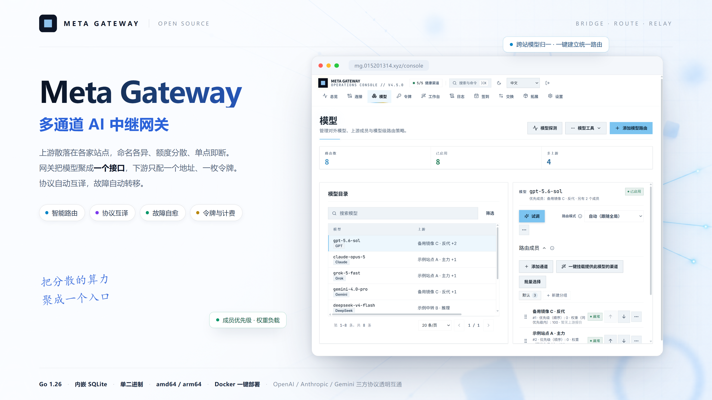
</picture>

<p>
  <a href="https://github.com/ZiChuanLan/meta-gateway/actions/workflows/ci.yml"></a>
  <a href="https://zichuanlan.github.io/meta-gateway/"></a>
  <a href="https://hub.docker.com/r/zichuanlan/meta-gateway"></a>
  <a href="https://github.com/ZiChuanLan/meta-gateway/releases"></a>
  <a href="https://github.com/ZiChuanLan/meta-gateway/releases"></a>
  <a href="https://github.com/ZiChuanLan/meta-gateway/stargazers"></a>
  <a href="https://github.com/ZiChuanLan/meta-gateway/blob/master/LICENSE"></a>
  <a href="https://linux.do"></a>
</p>

<p>
  
  
  
  
  <a href="https://github.com/ZiChuanLan/meta-gateway/issues"></a>
</p>

<p>
  <a href="https://zichuanlan.github.io/meta-gateway/"><strong>📖 完整文档</strong></a> ·
  <a href="https://zichuanlan.github.io/meta-gateway/guide/quickstart-docker">快速开始</a> ·
  <a href="https://zichuanlan.github.io/meta-gateway/reference/env-vars">配置全表</a> ·
  <a href="https://zichuanlan.github.io/meta-gateway/reference/admin-api">API 全表</a>
</p>

</div>

> [!TIP]
> **在线体验** · <https://mg.015201314.xyz> —  用户名 `admin` 登录密码 `123456`
>
> 公开演示环境，请勿存放生产敏感密钥。控制台内置 **经典 / 现代** 双外观与明暗主题，登录后即可切换体验。

## 它是什么

下游工具越接越多（Cursor、Claude Code、Cherry Studio、Open WebUI），而上游分散在各类站点（New API、One API、官方接口与各路代理）。各站模型命名各异、额度分散、容易单点故障。

**Meta Gateway** 是自托管的多通道聚合中枢：所有上游统一挂载，下游只需配置**一个接口地址、一个访问令牌**。

架构上坚持**透明 pass-through** —— 不改写请求语义、不注入提示词、不伪造响应。

| 痛点 | 做法 |
| :--- | :--- |
| **密钥繁多易混乱** | 统一中继代理，单一下游令牌即可穿透访问全站上游模型 |
| **渠道故障易中断** | 失败自动进入冷却并秒级转移备用通道，恢复后无感回归 |
| **模型命名不统一** | 跨渠道识别与一键别名归一，对外屏蔽上游命名碎片化 |
| **协议不兼容** | OpenAI / Anthropic / Gemini 原生格式自动双向互译 |
| **上游不是标准 OpenAI 形态** | 渠道级端点覆盖与请求/响应字段映射，支持任意路径透传 |
| **额度浪费需打卡** | 内置定时签到引擎，原生支持 Session Cookie 与保活 |
| **业务隔离需求** | 模型路由分组，为不同客户端精准分配专属通道集 |

> 完整的功能说明、每条规则的边界与踩坑记录都在[文档站](https://zichuanlan.github.io/meta-gateway/)。本文件只做门面。

## 界面预览

<div align="center">

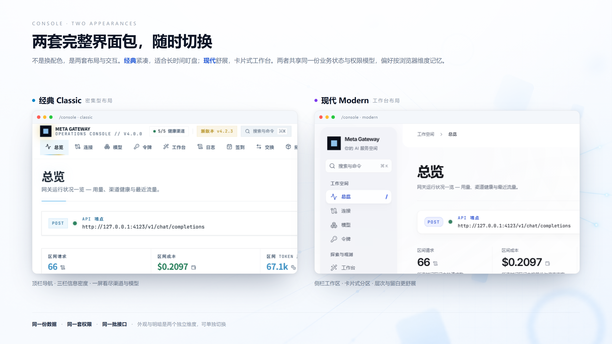

**经典 Classic** 紧凑信息密度，适合长时间盯盘运维 ｜ **现代 Modern** 卡片式工作台，层次更舒展

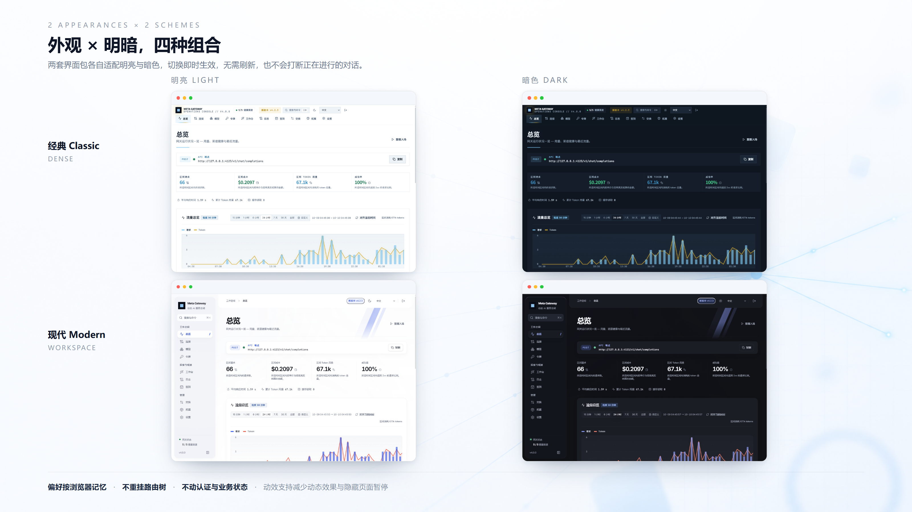

两套外观 × 明暗两种主题共 4 种组合，随时切换，偏好按浏览器维度记忆。

| 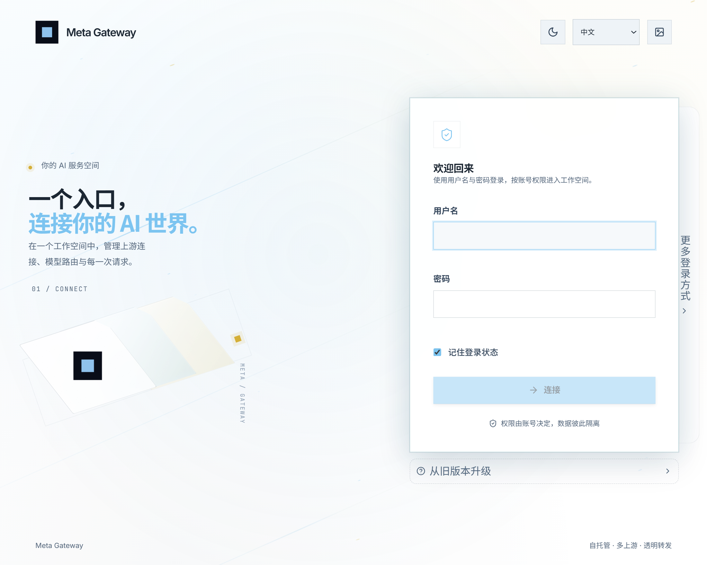<br><b>安全控制台</b> · 统一登录，暗色 / 明亮双主题 | 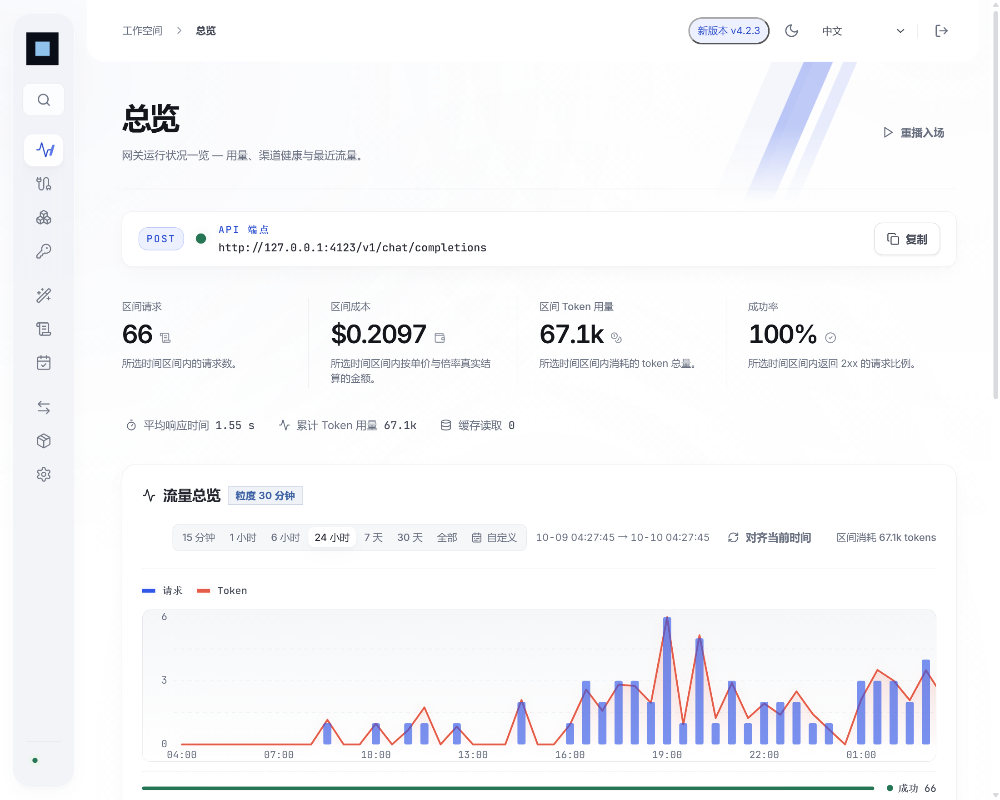<br><b>数据总览</b> · 实时吞吐、渠道健康与流量追踪 |
| :---: | :---: |
| 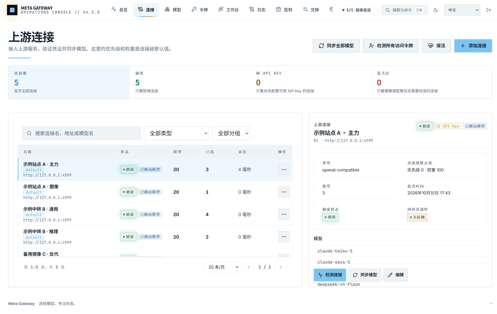<br><b>上游连接</b> · 多源站点、自动模型发现与鉴权 | 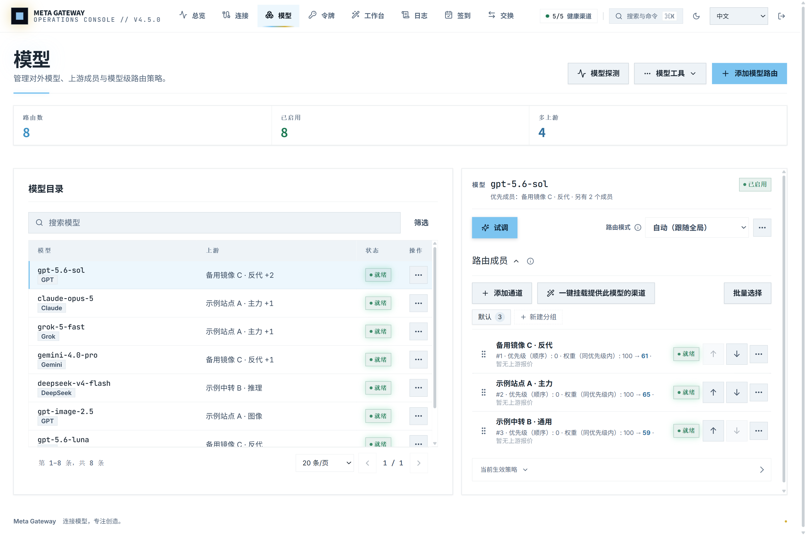<br><b>模型路由</b> · 成员优先级、权重负载与别名归一 |
| 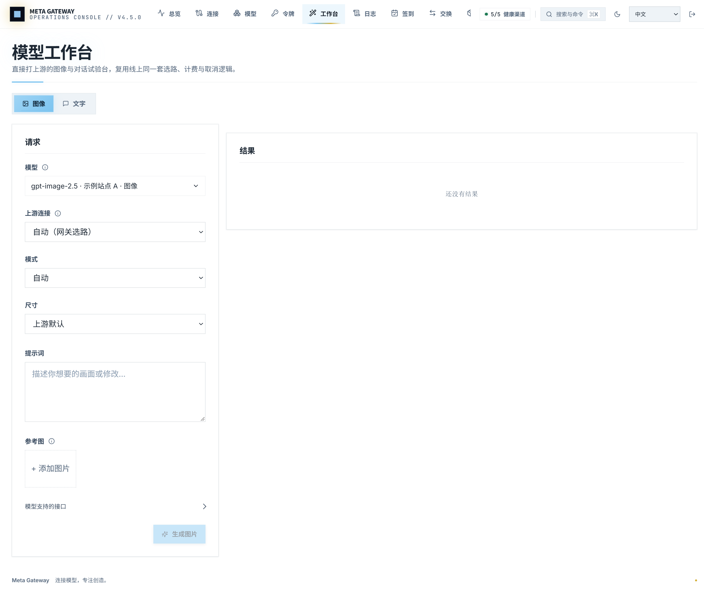<br><b>模型工作台</b> · 图像生成编辑、文字流式对话与能力校正 | 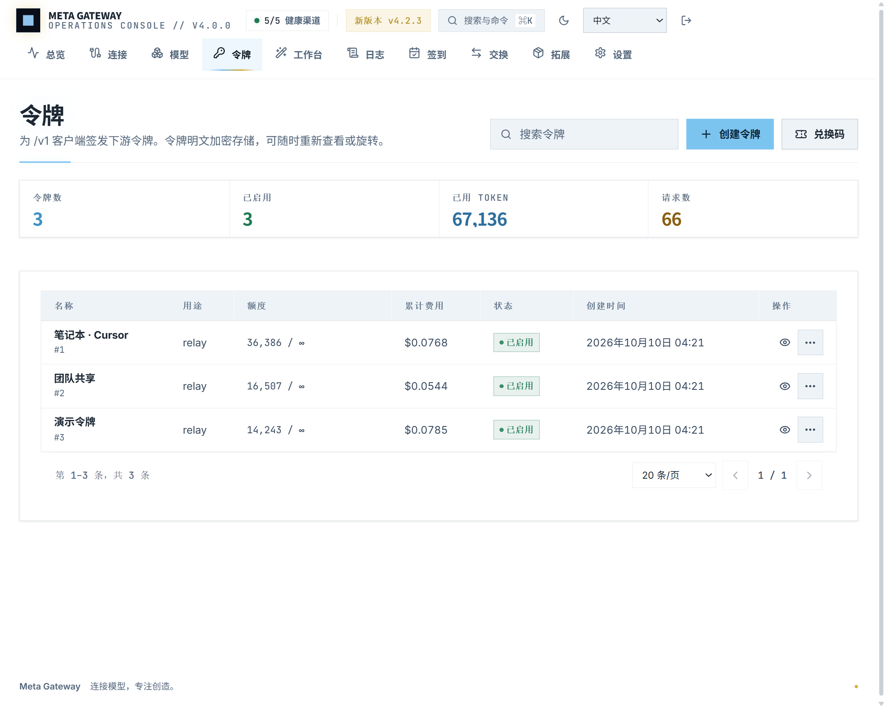<br><b>令牌管理</b> · 独立额度、路由分组绑定与调用统计 |
| 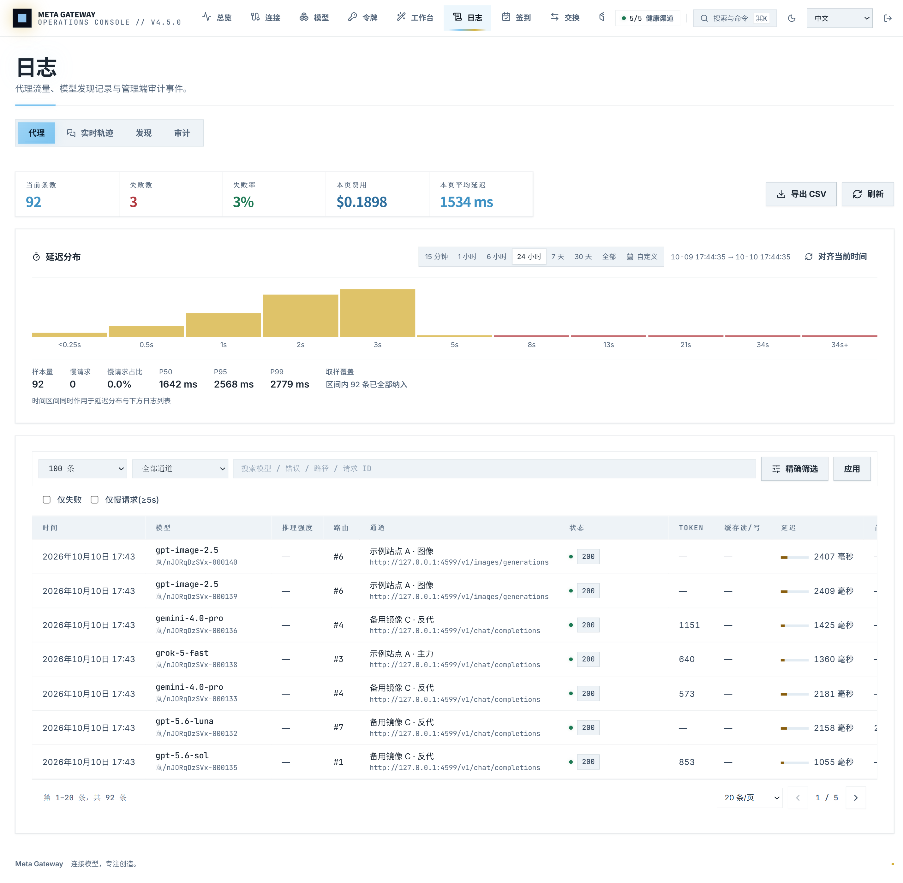<br><b>日志观测</b> · 延迟分布、失败率与代理审计 | 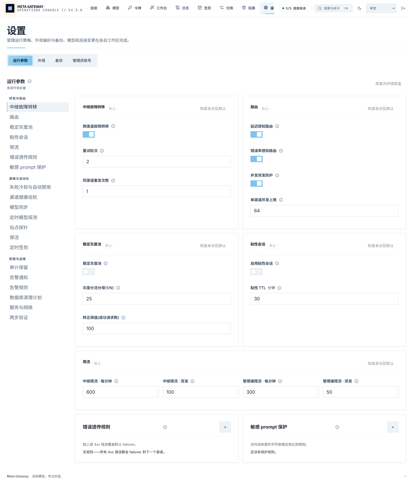<br><b>运行参数</b> · 故障转移、灰度发布与全局策略 |
| 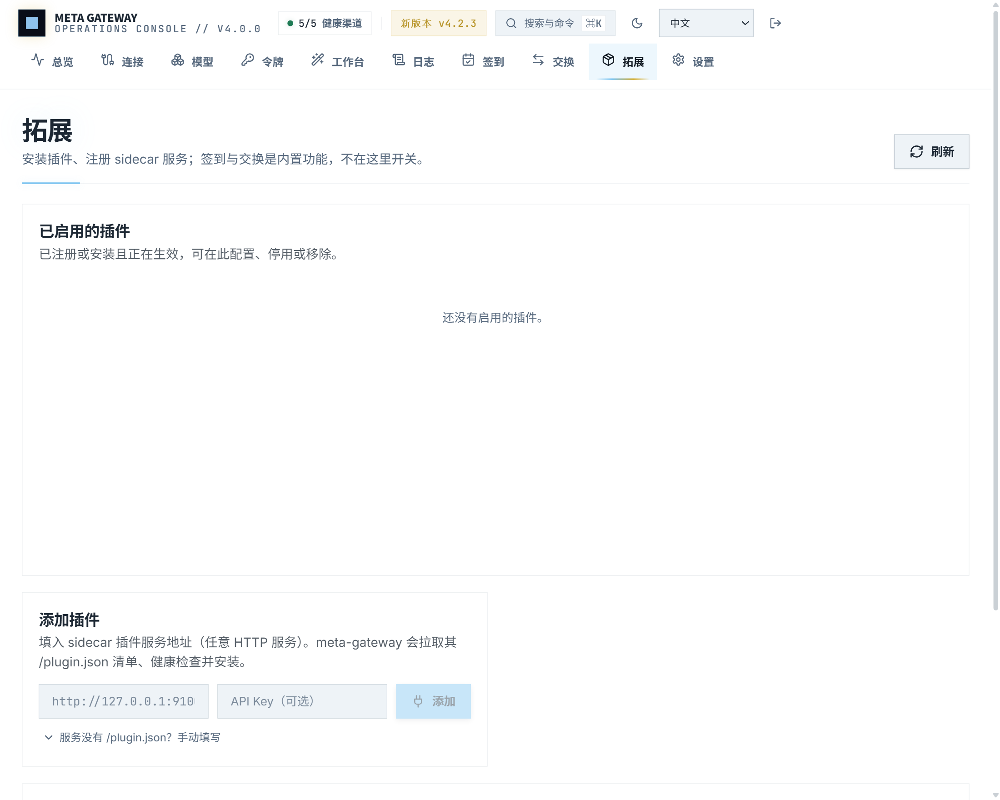<br><b>拓展</b> · 模块化扩展、沙箱隔离与托管进程 | 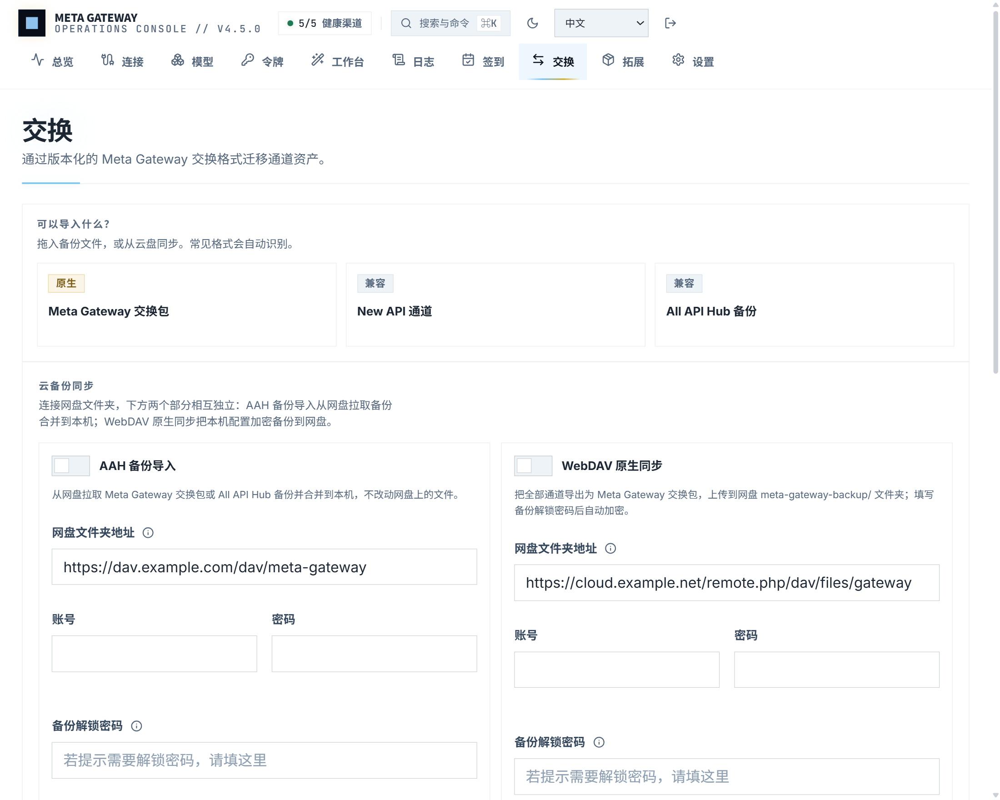<br><b>资产交换</b> · 拓扑快照、加密导入与 WebDAV 备份 |

</div>

## 快速开始

```yaml
# docker-compose.yml
services:
  meta-gateway:
      image: zichuanlan/meta-gateway:${IMAGE_TAG:-latest}   # latest = 正式版；beta = 预发布
    container_name: meta-gateway
    restart: unless-stopped
    ports:
      - "4100:4100"
    volumes:
      - ./data:/data
    environment:
      ADMIN_TOKEN: ${ADMIN_TOKEN:?ADMIN_TOKEN required}
      MASTER_KEY: ${MASTER_KEY:?MASTER_KEY 32-char required}
      METRICS_TOKEN: ${METRICS_TOKEN:-mg-metrics-secret}
```

```bash
export ADMIN_TOKEN=$(openssl rand -hex 16)
export MASTER_KEY=$(openssl rand -hex 16)   # 32 字符加密主密钥
docker compose up -d
curl --fail http://127.0.0.1:4100/readyz
```

访问 `http://localhost:4100/console/`，输入 `ADMIN_TOKEN` 进入控制台。

> [!IMPORTANT]
> **`MASTER_KEY` 必须随数据库一起备份、一起迁移。** 换一个 `MASTER_KEY` 打开同一个库，所有已存凭据都解不开。

> [!NOTE]
> **`:latest` 是稳定版（当前 `v4.0.0`）；`:beta` 是预发布。渠道由部署的 `IMAGE_TAG` 决定**：控制台只读展示它，
> 不提供切换（它改变不了容器跑的标签）。换渠道就是改 `.env` 并重建，**也不支持自动降级**：
>
> ```bash
> export IMAGE_TAG=beta
> docker compose pull meta-gateway && docker compose up -d --no-build --force-recreate meta-gateway
> ```
>
> **从 v3 升到 v4**：点控制台「更新」即可（会先自动备份数据库）；升级后用原管理口令登录，控制台会引导
> 认领管理员账号。想同时把 `.env` 里新增/修改的变量带进容器，再补做一次上面那条 `docker compose up -d`。
> 自动轮询默认关闭，要开就设 `WATCHTOWER_HTTP_API_PERIODIC_POLLS=true`（大版本会无人值守落地，含数据库迁移）。
> 详见[升级与更新渠道](https://zichuanlan.github.io/meta-gateway/guide/upgrade)。

单行 `docker run`、源码构建、AI 一键部署提示词、从 v3 升级到 V4 —— 见[文档站 / 入门](https://zichuanlan.github.io/meta-gateway/guide/)。

## 接入

把 API Base URL 指向网关，API Key 填管理后台颁发的**下游令牌**：

```bash
curl http://localhost:4100/v1/chat/completions \
  -H "Authorization: Bearer <你的下游令牌>" \
  -H "Content-Type: application/json" \
  -d '{"model":"deepseek-v4-flash","messages":[{"role":"user","content":"Hello!"}]}'
```

| 客户端类别 | Base URL | 传输协议 |
| :--- | :--- | :--- |
| Cursor / VS Code / Cherry Studio | `http://<网关>:4100/v1` | OpenAI 兼容 |
| Claude Code 等原生客户端 | `http://<网关>:4100/v1` | Anthropic Messages |
| Open WebUI / LibreChat | `http://<网关>:4100/v1` | OpenAI 兼容 |

## 文档

| 章节 | 内容 |
| :--- | :--- |
| [入门](https://zichuanlan.github.io/meta-gateway/guide/) | 定位、**核心概念**（站点/渠道/路由/令牌四层）、部署与升级 |
| [接入](https://zichuanlan.github.io/meta-gateway/clients/) | 下游协议、作用域与配额、流式与 SSE 语义、图像接口 |
| [上游](https://zichuanlan.github.io/meta-gateway/upstream/) | 站点与渠道、基础 URL 与端点规则、协议映射、站点探针 |
| [路由](https://zichuanlan.github.io/meta-gateway/routing/) | 选型算法、会话粘性、故障转移、冷却熔断、模型归一 |
| [计费](https://zichuanlan.github.io/meta-gateway/billing/) | 两层单价链、阶梯价与时段价、配额与用量账单 |
| [团队](https://zichuanlan.github.io/meta-gateway/team/) | 个人／团队模式、成员、团队码、第三方登录 |
| [控制台](https://zichuanlan.github.io/meta-gateway/console/) | 信息架构、主题包、交互约定 |
| [运维](https://zichuanlan.github.io/meta-gateway/operations/) | 架构、部署与反代、备份恢复、保留策略、**故障排查** |
| [插件](https://zichuanlan.github.io/meta-gateway/plugins/) | sidecar 协议、安装、配置与拦截钩子 |
| [参考](https://zichuanlan.github.io/meta-gateway/reference/) | **由代码生成**的配置、接口、错误码与数据结构全表 |

参考层由 `tools/docsgen` 从代码生成，CI 会校验生成结果与代码一致 —— 代码改了而文档没跟上，构建就红。

## 常见问题

<details>
<summary><strong>Q: 它和普通的反向代理或 Nginx 有什么本质区别？</strong></summary>

Nginx 是纯传输层转发，无法理解 AI 模型的语义。Meta Gateway 运行在应用协议层：它能够**解析 OpenAI / Claude / Gemini 的请求与流式包**，完成多协议互译、识别每个 Token 的用量进行精确扣费、在流式发生中断时秒级触发备用通道故障转移，并具备跨站模型聚合与自动探活机制。
</details>

<details>
<summary><strong>Q: 节点出现网络抖动时，会不会直接把正常渠道误禁用？</strong></summary>

不会。网关设有渐进式弹性防护机制：偶尔超时会先进入**平滑冷却期**并在后台执行静默健康探活，只有当连续失败触发阈值且探活全军覆没时才会触发通道保护。
</details>

<details>
<summary><strong>Q: 数据与凭证安全如何保证？</strong></summary>

1. 所有上游 API Key 在入库前均由 `MASTER_KEY` 执行 AES-GCM 高强度加密，仅在出站转发前在内存中瞬时解密；
2. 控制台 `ADMIN_TOKEN` 仅保留在浏览器当前会话内存中，不存 Cookie、不入 URL；
3. 出站流量全局搭载 SSRF 防护墙，严格拦截环回私网与非法重定向。
</details>

<details>
<summary><strong>Q: 模型的价格、上下文窗口和模态是从哪来的？会覆盖我手工填的值吗？</strong></summary>

优先级是**人工校正 > 外部目录同步 > 内置推断**。同步写入遵循「只填空位」：已有的值不会被覆盖，把字段清空即代表「要求下次同步重填」。人工改过的模型能力会被标记为 `manual` 并**永久冻结**。
</details>

<details>
<summary><strong>Q: 经典控制台和现代工作空间有什么区别？我只想换个明暗呢？</strong></summary>

两套是完整界面包，切换后布局、过场与控件风格整体变化。**明暗与配色是彼此独立的两个维度**——可以只切明暗、只换配色，也可以整套换包，互不干扰。偏好存在浏览器本地。
</details>

## Star History

<div align="center">

<a href="https://star-history.com/#ZiChuanLan/meta-gateway&Date">
  <picture>
    <source media="(prefers-color-scheme: dark)" srcset="https://api.star-history.com/svg?repos=ZiChuanLan/meta-gateway&type=Date&theme=dark" />
    <source media="(prefers-color-scheme: light)" srcset="https://api.star-history.com/svg?repos=ZiChuanLan/meta-gateway&type=Date" />
    
  </picture>
</a>

</div>

## 贡献

欢迎提 Issue 与 Pull Request。报问题时附上**网关版本、相关配置片段与日志**会省很多来回。

```bash
# 后端：构建 → 静态检查 → 单测（gofmt -l 应无输出）
go build ./... && go vet ./... && go test ./...
gofmt -l .

# 前端（在 web/ 目录下）
npm run lint && npm run typecheck && npm test -- --run && npm run build

# 文档站（在 docs/ 目录下）
go run ./tools/docsgen && npm ci && npm run build
```

提交前请确认这几条（CI 会逐条卡住）：

- **`gofmt` 干净** —— 流水线里有 `test -z "$(gofmt -l .)"`，格式化不通过会直接失败；
- 后端 `go vet ./...` 与 `go test ./...` 全绿（CI 另跑一遍 `go test -race ./...`，本地跑需要 cgo 与 gcc）；
- 前端 `lint` / `typecheck` / `test` / `build` 四项全绿；
- 新增数据库迁移时，同步更新 `store_test.go` 里的迁移数量断言；
- 改了代码里任何被 `docs/reference` 覆盖的事实（环境变量、端点、错误码、迁移、连接类型、供应商 profile），跑一遍 `go run ./tools/docsgen` 并提交结果。

涉及界面改动的 PR，请顺手贴一张改前 / 改后截图（本项目同时维护**经典 / 现代**两套界面包，两边都要看一眼）。

更细的约定见 [CONTRIBUTING.md](CONTRIBUTING.md)。

## 许可

以 **MIT License** 发布 —— 可自由商用、修改与再分发，只需保留原始版权声明。详见 [LICENSE](LICENSE)。

仓库本身不附带任何上游密钥或用户数据；实例内的凭证均由 `MASTER_KEY` 加密后存放在本地 SQLite 中。

致谢：
[LinuxDo](https://linux.do)、Metapi、Axonhub、allapihub、cc-switch、CPA、newapi、sub2api

---

<div align="center">

<p>
  <a href="https://github.com/ZiChuanLan/meta-gateway/stargazers"></a>
</p>

<sub><b>Meta Gateway</b> — 让分散的 AI 算力与模型，汇聚于极致优雅的统一入口 · <a href="#top">返回顶部</a></sub>

</div>
